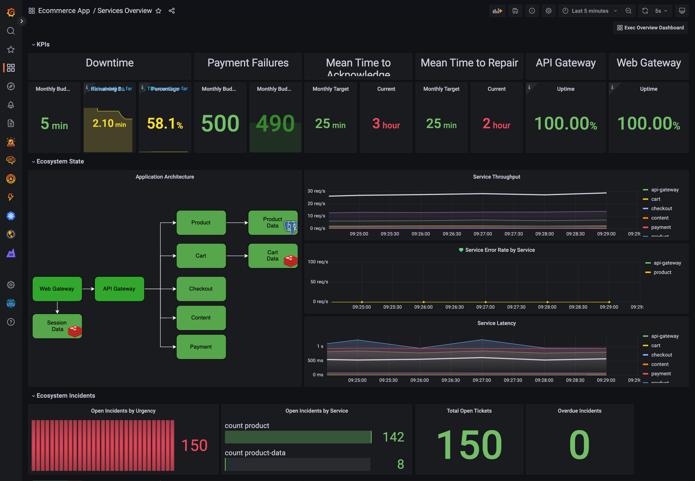
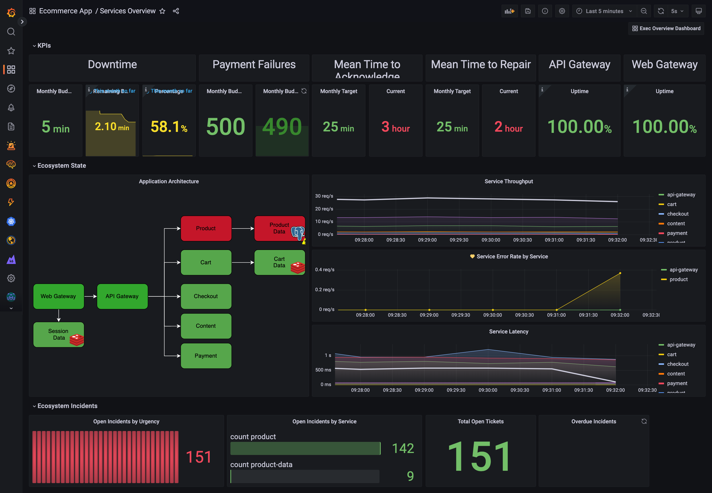
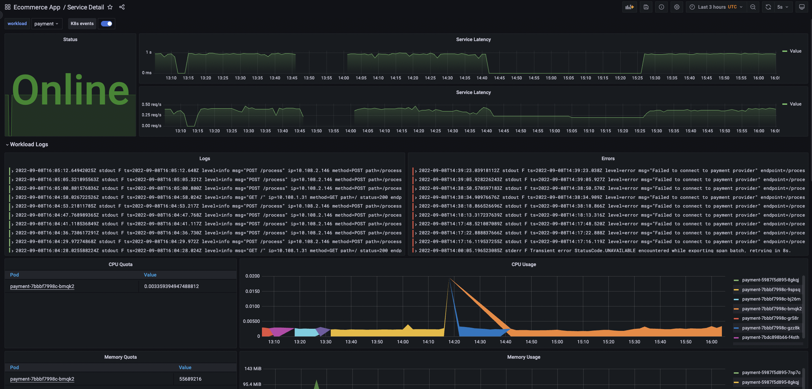

# Introduction
This project is built around the application Dave Moore built with his [Microbs Project](https://microbs.io/). It deploys mostly the same underlying Ecommerce App with a few tweaks to make injecting real life issues easier.

The dashboards start with a high level [RED](https://grafana.com/files/grafanacon_eu_2018/Tom_Wilkie_GrafanaCon_EU_2018.pdf) dashboard and then through the Architecture Diagram you can dive into details around each service and database. Using Grafana Cloud Logs, Metrics and Traces you can easily correlate the data to find the root cause. 

This project uses:
- Grafana Kuberenetes Monitoring App
- Alerts for SLIs
- Grafana Synthetic monitoring
- Realistic traces including Postgres & Redis
- Redis/Postgres integrations

The other cool thing about the demo is that I have a bunch of “errors” that can be injected into the app to cause issues. This makes demoing investigations super easy and you can investigate it as it happens.
- Too many postgres connections (logs/metrics/traces)
- Payment Failures (logs/traces) which causes an SLI to trend towards breach
- Throw a stack trace caused by a divide by zero error (logs/traces)

# Screenshots

# Resources created in GCP 
- GKE Cluster to deploy everything in

# Deploying the demo
## Step 1) Install required Software
- Terraform - https://learn.hashicorp.com/tutorials/terraform/install-cli
- Kubectl - https://kubernetes.io/docs/tasks/tools/#kubectl

## Step 2) Creating a Cloud API Key
Go to your Grafana Cloud Private Profile and create an [Admin Cloud API key](https://grafana.com/docs/grafana-cloud/reference/create-api-key/). Update terraform/vars.tfvars `grafana_cloud_api_key` variable with this key

## Step 3) Creating the GCP Service Account
To deploy GKE within GCP, you will need to create a GCP service account. I have only tested using "Editor" permissions due to limited time however the "Resources created in GCP " section above lists what is created to narrow the permissions as you see fit. 
1) Create the service account with Editor permissions
2) Download the JSON file and update the below variables within terraform/vars.tfvars
	- gcp_svc_acc_file_path - The file path to your downloaded service account file
	- gcp_project_id - The GCP project ID 

## Step 4) Update other required variables
Go to terraform/vars.tfvars and update the below variables:
	- owner_name - this should be your name in lower case without any spaces. This is used to prefix your name to the GKE cluster. A label called "owner" is also created for that GKE cluster with the value of `owner_name`
	- stack_slug - this is the name of the Grafana Cloud Stack that is created
	- grafana_stack_region_slug - For sake of convienience I would recommend leaving this as `us`. If you do change it, make sure you also update `synthetic_monitoring_backend_url` and `synthetic_monitoring_api_url` in accodance with [the docs](https://grafana.com/docs/grafana-cloud/synthetic-monitoring/private-probes/#probe-api-server-url)

## Step 5) Configure Slack
I have created a workspace called "akc-mlt-demo.slack.com" that you are welcome to come and use. If you do, everything is already configured to post alerts to #mlt-demo-workarea and you can skip the rest of this step. You're welcome to create a new channel and send alerts there by changing `slack_channel_name` within terraform/vars.tfvars. If you want to point the Slack alerts at your own workspace, please make sure you update `slack_channel_name` and `slack_bot_token`.

## Step 6) Deploy most of the things
- Go to the terraform directory
- Run `terraform init`
- Run `terraform apply -var-file vars.tfvars` - this will list everything that will be deployed. If you're happy with it type "yes" and enter when prompted
- When terraform finishes, it will display a bunch of outputs. Run the `gke_connection_command` in the terminal to connect to the GKE cluster. Then go open a browser and go to your stack by using the `grafana_url` URL.
- If you need to get these outputs again just go into the terraform directory and run `terraform output`

## Step 7) Create the recorded queries
Sadly the Terraform provider doesn't allow you to create recorded queries. We use these for the Flowchart Plugin as Loki's LogQL support count_over_time but if the filter doesn't return any logs, "no data" is returned. When using count_over_time over "no data" you don't get a numerical 0 as a result. You get "no data". When using this with the flow chart plugin you can't colour the boxes accordingly as there is no data to run the condition over. Quite frustating. As a way around this we can use a recorded query as that periodically counts how many logs have been returned that meet our error filter. Even if no logs are returned, the recorded query returns 0. Exactly the behaviour we need. We need one recording rule per database. To create them, go to explore, put in the respective query below and then click on the button to the right hand side of the query panel that looks like two circles - at the time of writing it was to the left of the copy button. When creating each of the below recorded queries, make sure you are using the `MLT Logs` data source.
- product-data
	- Query: `{cluster="microbs",container=~"product-data"} |~ "critical|Critical|CRITICAL|error|Error|ERROR|exception|Exception|EXCEPTION|fail|Fail|FAIL|fatal|Fatal|FATAL"`
	- Name: ProductDBErrors
	- Interval: 30 seconds
	- Relative Time Range: 
		- From: now-31s
		- To: no
	- Count query results: true
- session-data
	- Query: `{cluster="microbs",container=~"session-data|session-data-replica"} |~ "critical|Critical|CRITICAL|error|Error|ERROR|exception|Exception|EXCEPTION|fail|Fail|FAIL|fatal|Fatal|FATAL"`
	- Name: SessionDBErrors
	- Interval: 30 seconds
	- Relative Time Range: 
		- From: now-31s
		- To: no
	- Count query results: true
- cart-data
	- Query: `{cluster="microbs",container=~"cart-data|cart-data-replica"} |~ "critical|Critical|CRITICAL|error|Error|ERROR|exception|Exception|EXCEPTION|fail|Fail|FAIL|fatal|Fatal|FATAL"`
	- Name: CartDBErrors
	- Interval: 30 seconds
	- Relative Time Range: 
		- From: now-31s
		- To: no
	- Count query results: true

## Step 8) Import Dashboards
The Grafana Terraform provider allows you to import dashboards, however you can't override the datasources from within Terraform. Somewhat odd... So it's easier for you to important the four manually and then update the datasources accordingly.

You can find the dashboards in grafana/dashboards. Please import all four. Leave the UID as it is but update the data sources so they point to the ones beginnging with `MLT`, **not** the ones starting with `grafanacloud`. Please also put the dashboards in the "Ecommerce App" folder

## Step 9) Deploy the app
Here we are going to deploy our application and k6 which generates the load for the application. Make sure you are in the root directory of this git repo and run `kubectl apply -f app.yaml`

## Step 10) Enable your synthetic monitoring check
Terraform created a bunch of synthetic monitoring checks and left them all as disabled - this is as the app wasn't deployed yet. Not that it is we need to enable them. 
- Go to Grafana's Synthetic Monitoring App - you may need to click the "Initialize the plugin" button
- Go to the Checks page
- Select all checks (the top most checkbox above the first check) and click the blue `Enable` button

## Step 11) Have fun!
Everything is now deployed! I recommend opening the Service Overview Dashboard and then explore the demo story below including the types of bugs you can introduce. Give it a few minutes before data starts coming through.

# Demo Story and Flow
## Step 1) Walk through the normal state
- Open the Service Overview page
- Explain what RED signals are 
- Explain that this page is built from Synthetic Monitoring & Trace Data and Log Data
- Show the high level SLIs and explain that these can be anything of value to the customer
- Explain that the architecture is from the FlowChart plugin and drawn with DrawIO - not automatically inferred. However, this works to our advantage as if it was automagically inferred that means we couldn't build our own custom rules into it as you will see later.
- Click on Product on the architecture to show how we can use that to deep dive into a given service/database
- Explain this detailed dashboard
- Look at the Logs panel and click on one for `/documents` and then view the trace
- Show the path of the request and show that we can see the Postgres SQL statement for this request. Also show that we can see the "Logs for this span" button
- Then go back to the Overview page

## Step 2) Cause an error
### Too Many Postgres Connection
This error opens a bunch of connections to the Postgres database to throw a common bug which is "Too many open connections". This can be triggered by running `variants/too_many_connections_bug.sh` and runs for 4 minutes. Please make sure you are connected to the GKE cluster for this as this script uses kubectl. 

When this is fired, it will take a minute for it to come through. When it does, both the Product Data and Product components turn Red to show they are in a bad state. The Latency increases but not enough to breach the SLO. After a little while a Slack alert will fire. To debug this, click on the Product red box and pick an error to view it's trace. You will see that it can't connect as connections are being refused. Go back to the overview and click on Product-Data to see why. You will see in the error box that it says too many connections. 

### Kill the API Gateway
This is simple but effective. To do this just run `kubectl delete deploy api-gateway`. This will turn the API-Gateway box red in the Service Overview dashboard and the Downtime budget remaining SLI will start decreasing. Click on the API-Gateway component box and you will see that the state is Offline - this is reported by the synthetic monitoring check. To bring it back online just run `kubectl apply -f app.yaml`.

### Payment Issues
This causes the `Payment Error Failure Budget remaining this month` SLI to start decreasing. It deploys a buggy version of the payment service which occasionally will throw an error "Failed to connect to payment provider". To trigger this run `kubectl apply -f variants/payment-failures.yaml`. It will take a minute or so for this to actually happen so small talk is your friend when demoing here.

The Payment component will turn red in the services overview dashboard. When you click on it you will notice a bunch of errors, click on one, open the trace and see what is happening. Then click "Logs for this span" to see the error in the logs.

To fix this, just run `kubectl apply -f app.yaml`

## Latency SLO Breach
Finally, this bug is super simple and not super realistic. What it does is deploys a buggy version of the Product service which runs a long calculation and then divides it by 0 to cause an exception. Unit testing should capture this in reality however it's good as it causes an Latency SLO breach. To run it do `kubectl apply -f variants/basic-bug`.

To debug this you will notice the Product component turning red. Click on it and see the errors.

To solve it run `kubectl apply -f app.yaml`.

# Tearing everything down and cleaning Up
Go into the terraform directory and run `terraform destroy -var-file vars.tfvars -auto-approve`. **Everything** will be deleted