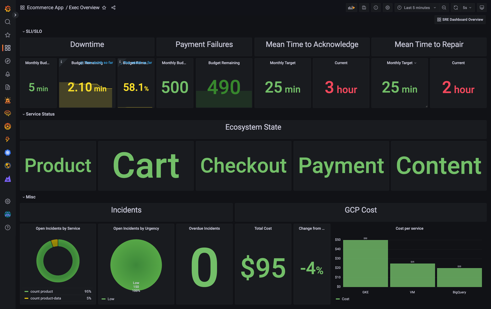
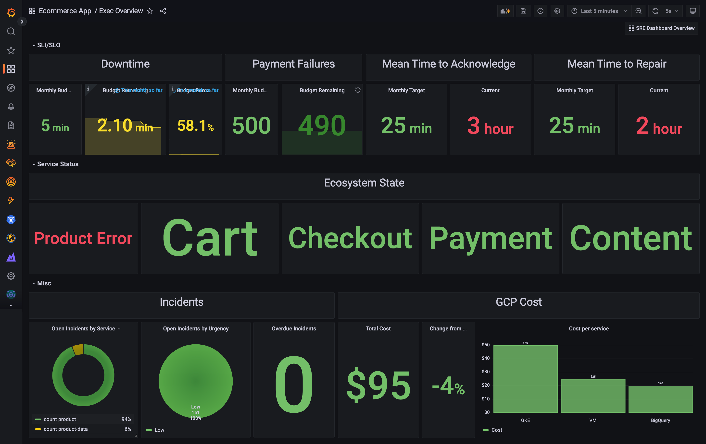
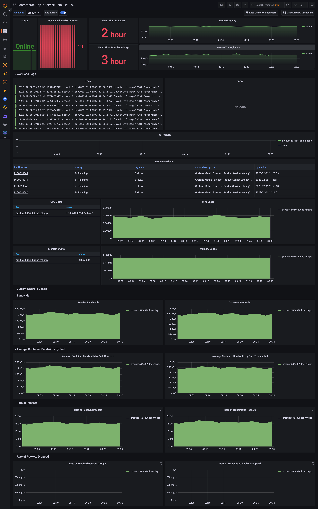
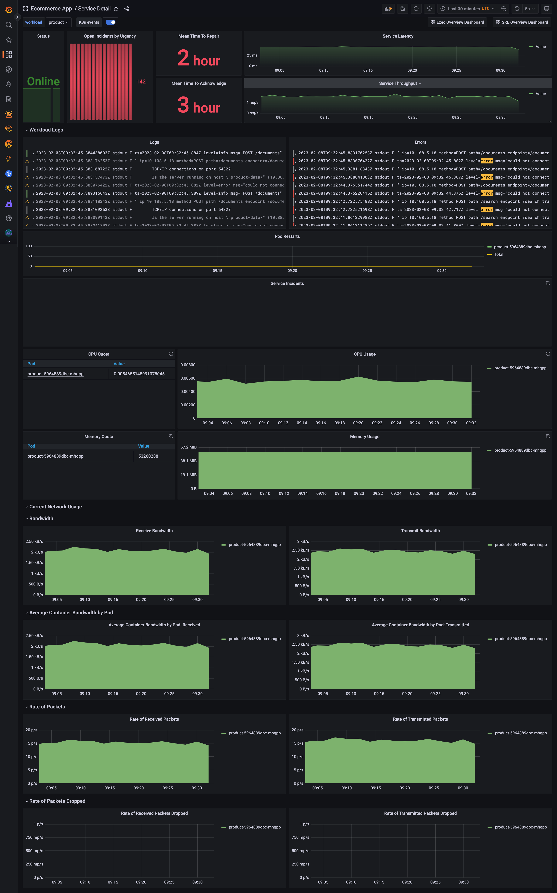

Table of Contents
- [Introduction](#introduction)
- [Resources created in GCP](#resources-created-in-gcp)
- [ServiceNow Configuration](#servicenow-configuration)
- [Deploying the demo](#deploying-the-demo)
- [Types of errors you can cause](#types-of-errors-you-can-cause)
- [Demo Story and Examples](#demo-story-and-examples)
  * [Example Demo Script](#example-demo-script)
  * [Video of demo by Dan Mihai Dinu](#video-of-demo-by-dan-mihai-dinu)
- [Tearing everything down and cleaning Up](#tearing-everything-down-and-cleaning-up)

# Introduction
This project is built around the application Dave Moore built with his [Microbs Project](https://microbs.io/). It deploys mostly the same underlying Ecommerce App with a few tweaks to make injecting real life issues easier and to make use of the wider Grafana stack.

The dashboards are hierarchical. Starting with a high level exec overview dashboard and moving down to a SRE Overview dashboard which makes used of [RED signals](https://grafana.com/files/grafanacon_eu_2018/Tom_Wilkie_GrafanaCon_EU_2018.pdf) and then through the Architecture Diagram you can dive into details around each service and database. Using Grafana Cloud Logs, Metrics and Traces you can easily correlate the data to find the root cause. 

ServiceNow is used as an ITSM for this demo and Mean Time to Recover (MTTR) and Mean Time to Acknolwedge (MTTA) are calculated from this live data. Each alert sends an incident over to ServiceNow. I do not pretend to be a ServiceNow expert in any way shape or form. If you have any concerns or advise on how ServiceNow is used please do let me know. I have also disregarded security best practices here for simplicity. 

This project uses:
- Grafana Kuberenetes Monitoring App
- Alerts for notifying SLO breaches
- Grafana Synthetic monitoring
- Realistic traces including Postgres & Redis
- Redis/Postgres integrations
- Grafana K6 for load generation
- ServiceNow for Incident Response
- Grafana Machine Learning Forecasting for smarter alerting

The other cool thing about the demo is that I have a bunch of “errors” that can be injected into the app to cause issues. This makes demoing investigations super easy and you can investigate it as it happens.
- Too many postgres connections (logs/metrics/traces)
- Payment Failures (logs/traces) which causes an SLI to trend towards breach
- Deploy a bad version of a service to make latency spike (logs/traces)

# Screenshots
Healthy Executive Dashboard


Unhealthy Executive Dashboard


Healthy SRE Overview


Unhealthy SRE Overview


Healthy Service Detail


Unhealthy Service Detail


# Resources created in GCP 
- GKE Cluster to deploy everything in

# ServiceNow Configuration
There are two options here, use the ServiceNow instance I have created to use in the demo or spin up your own. If you want to use mine, please contact me on slack for the credentials

## Using my ServiceNow which is already configured
Contact me on Slack for the details.

## Setting up your own ServiceNow
#### Setting up a fresh ServiceNow instance
- [Set up a free Personal Development Instance](https://developer.servicenow.com/dev.do#!/home)
- Create an App but don't set any of the fields except Name (I am not really sure what they do)
- Access the instance by clicking on our profile whilst in developer.servicenow.com and click "Manage Instance password" and take note of the URL, username and password
- Read the "Using an existing ServiceNow instance" section to continue

#### Using an existing ServiceNow instance
We need to do a few things to ServiceNow to make it ready for the integration
1) Creating two fields within the incident table, one for the the service with an issue, the other the date of when an incident went from New to In Progress
2) A business rule metric to populate the new incident field which holds the date from when an incident went from New to In Progress
3) A scripted metric that creates an incident for us via a REST API

#### Creating a Business Rule Metric for Mean Time to Acknowledge (MTTA)
MTTA is the average time it takes for a ticket to go from "Created" to "In Progress". I couldn't find a clean column in the Incident table for this so I created a Business Rule metric. To do this, follow the below steps:
- On the left hand menu look for the "Incident" heading and click "All" just below that. Choose any existing Incident and open it
- Next to the incident number at the top of the New Incident Form, click on the burger menu (three horizonal lines), click configure and then click form design
- In the middle of the page you will see the form design, the top grey bar says "Incident [incident]" and at the far right end is a "+" button, click it to create a new section and name that section "Product Details"
- On the far left hand side, click the "Field Types" tab above the list of fields, find "Date/Time" and drag it into the new section
- Click the settings cog icon for that new field. Set the Label to "When Acknowledged" and the Name to "ack_datetime".
- Click Save at the top right
- For some reason for me the new field disappears and I need to go to the field tab on the right, search for the field I just created and drag it back in. Do this and then set the field to readonly by clicking on it's cog icon again. *TAKE NOTE OF THE 'NAME' SERVICENOW HAS ASSIGNED THIS FIELD - YOU WILL NEED IT LATER*
- Click Save again.
- Open the "Business Rules" app under "Metrics" in the left hand bar within ServiceNow
- Create a new Business rule
- Set the Name to "Grafana New to In Progress Duration"
- Set the table to "Incident"
- Go to the "When to run tab" and add two conditions with an "AND" condition
	- Incident State Changes from New 
	- Incident State Changes to In progress
- Go to the "Actions" tab
	- Set "When Acknowledged" "Same As" "Updated" - When Acknowledge if the field we created above

## Creating an Endpoint so we can create an incident from Grafana
For Grafana to create an incident within ServiceNow, we need ServiceNow to accept a webhook request, process the data in the alert and then save the incident. Because data is fun, we are also going to add an extra field which is "Service Name" so that we can see which service an incident relates to.
- Follow the steps found in "Creating a Business Rule Metric for Mean Time to Acknowledge (MTTA)" for creating a new field and add it to the same section as your previously created field. This new field will have the label "Service name" and the name "service". Make sure you set it to read only and make sure you get the new name when you add the field back in. If none of this makes sense, please re-read the "Creating a Business Rule Metric for Mean Time to Acknowledge (MTTA)" section.
- Time to create our REST endpoint. On the left hand side menu search for "Scripted Rest API" under "System Web Services". Create a new one with the name "Create Grafana Incident" and click Submit
- Open your new endpoint by searching for it in the list of endpoints
- Take note of the "Base API path" - you will need this later
- Under the resources tab towards the bottom, click "New"
	- Set Name to be "create incident"
	- Set HTTP method to POST
	- Set the script to be the below blob:
			(function process( /*RESTAPIRequest*/ request, /*RESTAPIResponse*/ response) {
				var title;
				var forecast_url;
				var forecast_name;
				var dashboard;
				var anomalous_value;
				var anomalous_actual;
				var anomalous_predicted;
				var service;
				var requestBody = request.body;
				var requestData = requestBody.data;
				gs.info(JSON.stringify(requestData));
				for (var i = 0; i < requestData.alerts.length; i++) {
					var inc = new GlideRecord('incident');
					inc.initialize();
					title = requestData.title;
					forecast_url = requestData.alerts[i].annotations.grafana_ml_forecast_url;
					forecast_name = requestData.alerts[i].annotations.grafana_ml_forecast_name;
					dashboard = requestData.alerts[i].annotations.dashboard_url;
					anomalous_value = requestData.alerts[i].annotations.anomalous_value;
					anomalous_actual = requestData.alerts[i].annotations.anomalous_actual;
					anomalous_predicted = requestData.alerts[i].annotations.anomalous_predicted;
					service = requestData.alerts[i].annotations.service;
					inc.x_977123_grafana_0_service = service;
					inc.caller_id = 'admin';
					inc.description = "Grafana ML Generated Incident - " + forecast_name + " Forecast Triggered \n - Anomalous Value: " + anomalous_value + " \n - Anomalous Predicted: " + anomalous_predicted + " \n - Anomalous Actual: " + anomalous_actual + "\n - Forecast URL: " + forecast_url + "\n - Dashboard URL: " + dashboard;
					inc.short_description = "Grafana Metric Forecast '" + forecast_name + "' Created Incident";
					inc.insert();
			}
		- Replace "x_977123_grafana_0_service" with the field generated by ServiceNow when you created your new "Service Name" field
		- Click Submit

# Deploying the demo
## Step 1) Install required Software
- Terraform - https://learn.hashicorp.com/tutorials/terraform/install-cli
- Kubectl - https://kubernetes.io/docs/tasks/tools/#kubectl

## Step 2) Creating a Cloud API Key
Go to your Grafana Cloud Private Profile and create an [Admin Cloud API key](https://grafana.com/docs/grafana-cloud/reference/create-api-key/). Update terraform/vars.tfvars `grafana_cloud_api_key` variable with this key

## Step 3) Creating the GCP Service Account
To deploy GKE within GCP, you will need to create a GCP service account. I have only tested using "Editor" permissions due to limited time however the "Resources created in GCP " section above lists what is created to narrow the permissions as you see fit. 
1) Create the service account with Editor permissions
2) Download the JSON file and update the below variables within terraform/vars.tfvars
	- gcp_svc_acc_file_path - The file path to your downloaded service account file
	- gcp_project_id - The GCP project ID 

## Step 4) Update other required variables
Go to terraform/vars.tfvars and update the below variables:
- owner_name: this should be your name in lower case without any spaces. This is used to prefix your name to the GKE cluster. A label called "owner" is also created for that GKE cluster with the value of `owner_name`
- stack_slug:  this is the name of the Grafana Cloud Stack that is created
- grafana_stack_region_slug:  For sake of convienience I would recommend leaving this as `us`. If you do change it, make sure you also update `synthetic_monitoring_backend_url` and `synthetic_monitoring_api_url` in accodance with [the docs](https://grafana.com/docs/grafana-cloud/synthetic-monitoring/private-probes/#probe-api-server-url)
- servicenow_url: The URL pointing to your ServiceNow PDI
- servicenow_username: The username for ServiceNow
- servicenow_password: The password for ServiceNow
- servicenow_create_incident_endpoint: The FQDN for the base api path of the endpoint created in servicenow

https://dev124466.service-now.com/api/x_977123_grafana_0/create_incident

## Step 5) Create a Grafana Enterprise licence 
Using your internal knowledge from Grafana Labs, or by talking to someone at Grafana Labs, get hold of an Enterprise licence for your Grafana Cloud stack. This is to enable you to install and use the ServiceNow plugin.

## Step 6) Configure Slack
I have created a workspace called "akc-mlt-demo.slack.com" that you are welcome to come and use. If you do, everything is already configured to post alerts to #mlt-demo-workarea and you can skip the rest of this step. You're welcome to create a new channel and send alerts there by changing `slack_channel_name` within terraform/vars.tfvars. If you want to point the Slack alerts at your own workspace, please make sure you update `slack_channel_name` and `slack_bot_token`.

## Step 7) Deploy most of the things (except the app itself)
- Go to the terraform directory
- Run `terraform init`
- Run `terraform apply -var-file vars.tfvars` - this will list everything that will be deployed. If you're happy with it type "yes" and enter when prompted
- This will get most of the way through until the ML job and then fail with an error that looks like `│ Error: status: 400, body: apiKey not set`. You need to go into the Grafana Stack, go to the Machine Learning App and click initalise. This is a bug and the team are working on fixing it. Once you have initalised the ML app. Re-run `terraform apply -var-file vars.tfvars`
- The Machine Learning Forecast needs 100 datapoints in order to be useful, so you will need to wait an hour or so to get enough data for it to be able to fire. In order to gather the data, run the below step. 
- When terraform finishes, it will display a bunch of outputs. Run the `gke_connection_command` in the terminal to connect to the GKE cluster. Then go open a browser and go to your stack by using the `grafana_url` URL.
- If you need to get these outputs again just go into the terraform directory and run `terraform output`

## Step 8) Deploy the app
Here we are going to deploy our application, make sure you are in the root directory of this git repo and run `kubectl apply -f app.yaml`. The app deployment is seperate as depending on the variant/bug introduced you might need to revert back to the original app and that is easier running the above command. 

There is currently a bug in the machine learning terraform resource where it incorrectly selects the algorithm for metric forecasts. You may need to open your metric forecast in Grafana, edit the forecast, select the algorithm and click update.

## Step 9) Create the recorded queries
Sadly the Terraform provider doesn't allow you to create recorded queries. We use these for the Flowchart Plugin as Loki's LogQL support count_over_time but if the filter doesn't return any logs, "no data" is returned. When using count_over_time over "no data" you don't get a numerical 0 as a result. You get "no data". When using this with the flow chart plugin you can't colour the boxes accordingly as there is no data to run the condition over. Quite frustating. As a way around this we can use a recorded query as that periodically counts how many logs have been returned that meet our error filter. Even if no logs are returned, the recorded query returns 0. Exactly the behaviour we need. We need one recording rule per database. To create them, go to explore, put in the respective query below and then click on the button to the right hand side of the query panel that looks like two circles - at the time of writing it was to the left of the copy button. When creating each of the below recorded queries, make sure you are using the `MLT Logs` data source. Also make sure you are writing the Recorded Query to the `MLT Metrics` data source.
- product-data
	- Query: `{cluster="microbs",container=~"product-data"} |~ "critical|Critical|CRITICAL|error|Error|ERROR|exception|Exception|EXCEPTION|fail|Fail|FAIL|fatal|Fatal|FATAL"`
	- Name: ProductDBErrors
	- Interval: 30 seconds
	- Relative Time Range: 
		- From: now-31s
		- To: now
	- Count query results: true
- session-data
	- Query: `{cluster="microbs",container=~"session-data|session-data-replica"} |~ "critical|Critical|CRITICAL|error|Error|ERROR|exception|Exception|EXCEPTION|fail|Fail|FAIL|fatal|Fatal|FATAL"`
	- Name: SessionDBErrors
	- Interval: 30 seconds
	- Relative Time Range: 
		- From: now-31s
		- To: now
	- Count query results: true
- cart-data
	- Query: `{cluster="microbs",container=~"cart-data|cart-data-replica"} |~ "critical|Critical|CRITICAL|error|Error|ERROR|exception|Exception|EXCEPTION|fail|Fail|FAIL|fatal|Fatal|FATAL"`
	- Name: CartDBErrors
	- Interval: 30 seconds
	- Relative Time Range: 
		- From: now-31s
		- To: now
	- Count query results: true
- payment
	- Query: ```{service="payment"} | logfmt | endpoint = `/process` | status != `200` ```
	- Name: PaymentProcessErrors1m
	- Interval: 30 seconds
	- Relative Time Range: 
		- From: now-1m
		- To: now
	- Count query results: true

## Step 10) Enable your synthetic monitoring check
Terraform created a bunch of synthetic monitoring checks and left them all as disabled - this is as the app wasn't deployed yet. Not that it is we need to enable them. 
- Go to Grafana's Synthetic Monitoring App - you may need to click the "Initialize the plugin" button
- Go to the Checks page
- Select all checks (the top most checkbox above the first check) and click the blue `Enable` button

## Step 11) Have fun!
Everything is now deployed! I recommend opening the Service Overview Dashboard and then explore the demo story below including the types of bugs you can introduce. Give it a few minutes before data starts coming through.

# Types of Errors you can cause
## Too Many Postgres Connection
This error opens a bunch of connections to the Postgres database to throw a common bug which is "Too many open connections". This can be triggered by running `variants/too_many_connections_bug.sh` and runs for 4 minutes. Please make sure you are connected to the GKE cluster for this as this script uses kubectl. 

When this is fired, it will take a minute for it to come through. When it does, both the Product Data and Product components turn Red to show they are in a bad state. The Latency increases but not enough to breach the SLO. After a little while a Slack alert will fire. To debug this, click on the Product red box and pick an error to view it's trace. You will see that it can't connect as connections are being refused. Go back to the overview and click on Product-Data to see why. You will see in the error box that it says too many connections. 

## Kill the API Gateway
This is simple but effective. To do this just run `kubectl delete deploy api-gateway`. This will turn the API-Gateway box red in the Service Overview dashboard and the Downtime budget remaining SLI will start decreasing. Click on the API-Gateway component box and you will see that the state is Offline - this is reported by the synthetic monitoring check. To bring it back online just run `kubectl apply -f app.yaml`.

## Payment Issues
This causes the `Payment Error Failure Budget remaining this month` SLI to start decreasing. It deploys a buggy version of the payment service which occasionally will throw an error "Failed to connect to payment provider". To trigger this run `kubectl apply -f variants/payment-failures.yaml`. It will take a minute or so for this to actually happen so small talk is your friend when demoing here.

The Payment component will turn red in the services overview dashboard. When you click on it you will notice a bunch of errors, click on one, open the trace and see what is happening. Then click "Logs for this span" to see the error in the logs.

To fix this, just run `kubectl apply -f app.yaml`

## Latency SLO Breach - ML Metric Forecast Demo
Finally, this bug is super simple and not super realistic but has a cool additional workload. What it does is deploys a buggy version of the Product service which runs a long calculation and then divides it by 0 to cause an exception. Unit testing should capture this in reality however it's good as it causes an Latency SLO breach. To run it do `kubectl apply -f variants/basic-bug`. It also uses an ML Metric Forecast called ProductServiceLatency, if the Latency from the Product service is unusual an alert is triggered which fires an incident over in ServiceNow. This is the only issue that uses ML Metric Forecasts.

To debug this you will notice the Product component turning red. Click on it and see the errors.

To solve it run `kubectl apply -f app.yaml`.


# Demo Story and Examples
## Example Demo Script 
- **SHOW MLT DEMO DASHBOARD**
- This is a really high level dashboard which is designed to tell us if we are on track with our SLOs and tell us if there is a problem in the application. It indicates where the issue is and allow you to drill down to the respect areas
- This is an ecommerce microservices application running in Kubernetes
- We have two SLIs and SLOs
- Imagine we have a contract with our customers that says your SLA of uptime will be 99.99%. That means you’re allowed 5 minutes of downtime a month and we need to track that. That is what the SLI is doing. It shows us that we have 4 minutes and 10 seconds left within that budget
- Furthermore, we have made a SLA with our customer that only 500 payments will fail per month, we have 44 remaining of that budget which is quite worrisome hence it’s turned red
- We are using our Synthetic Monitoring solution to show us our uptime and reachability 
- We also have three graphs on the right to track our RED Signals.
- Explain what RED signals are and how they are a proxy for end user experience
- Finally, we have our architecture diagram
- This is a high level diagram which was drawn manually using Draw.io
- The benefit of drawing it manually is that we can abstract low level constructs such as how many different services/containers/components are included within each service as an example
- The other benefit is that we can define rules to determine when one of those components is broken. 
- Take product for example, Product turns red if:
    - Synthetics says it’s offline
    - There are errors within it’s logs
    - It’s downstream database is having specific issues
    - It’s requests latency breach their SLO of 2 seconds
- An automatically drawn diagram wouldn’t be able to have these kind of rules defined as they come from different data sources - referring back to our big tent story
- We can also click on this diagram to drill down.
- **CLICK ON PRODUCT**
- On this dashboard we have the status of Offline/Online From synthetics
- We have Latencies and Throughputs from tracing
- We have logs and error logs 
- In addition we have Memory, CPU and Bandwidth metrics to help us identify what’s going on
- I would note that on the metrics front we are using 0.006% of the CPU. So straight away I can see that I am probably over provisioning this CPU and I can reduce that to save money 
- I next want to show you how we can jump to traces from logs to see the full life span of a trace
- **CLICK ON ANY LOG THAT GOES TO /documents, then go to the trace**
- This page shows us the path of a particular trace, starting at the web gateway, then the API gateway, then the product service and then finally the the database
- **CLICK ON THE DATABASE TRACE AND EXPAND ATTRIBUTES**
- Here we can see that we are running the SQL Statement shown (HIGHLIGHT IT) on the Postgres database Products table and User2 is the one running the query. We can also see that Opentelemtry was the library that instrumented it
- **EXPAND RESOURCE**
- Here we can see information about the product service and can see it’s a Python application and we can see the pod name, environment, service name and service version. Useful for debugging!
- I would also note that we can see all the logs for this span by click that button
- **GO BACK TO THE MLT DEMO OVERVIEW DASHBOARD**
- **RUN THE /too_many_connections_bug.sh SCRIPT - IT CAN TAKE Up to 1 minute to come through**
- I have just injected an error into my environment. We are going to live debug it together. We just have to wait a few seconds for Kubernetes to deploy the error
- **WAIT**
- We can now see that the Product and Product Data boxes have gone red. It looks like they are unhealthy. Let’s investigate what’s going on
- **CLICK ON PRODUCT**
- We can see it’s online
- We can see latency increasing which means users are having a slower experience
- We can see throughput is decreasing which either means they are leaving or it’s a byproduct of increased latency
- We can now see errors, let’s see what the traces tell us
- **CLICK ON ONE OF THE ERRORS FOR /Documents and open it’s trace and expand Events**
- We can see that an exception has occurred which says connection is refused to product-data and we can see where that has occurred due to the stack trace
- Very odd, let’s go and investigate product-data to see what is going on there
- **GO BACK TO OVERVIEW PAGE AND CLICK ON PRODUCT-DATA**
- The logs are telling us that there are too many clients connected to the postgres database. We should either increase that configuration value or investigate why they are not closing 

## Video of Demo by Dan Mihai Dinu
Dan presented this demo at Big Data Week Bucharest and you can see his great walkthrough [here](https://youtu.be/pDu7zu5ymJc?t=764).


# Tearing everything down and cleaning Up
Go into the terraform directory and run `terraform destroy -var-file vars.tfvars -auto-approve`. **Everything** will be deleted
